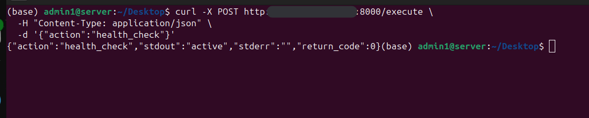

# Policy-Executed API (Security Engineering POC)

A small FastAPI project demonstrating **policy-enforced command execution**.

The API exposes **operational intent**, not shell access.

It demonstrates:
- deny-by-default action enforcement
- strict allow-listing
- no shell execution
- command injection prevention
- bounded execution (timeout + output limit)
- audit logging
- secure deployment via GitHub Actions + AWS SSM (OIDC)
- systemd service hardening

---

## What This Is

- A **policy-driven execution API**
- A **controlled command runner**
- A runnable **proof of concept**
- Built to demonstrate real security engineering fundamentals

This mirrors how real systems handle:
- remediation actions
- operational automation
- least-privilege execution
- secure CI/CD

---

## API Endpoint

```
POST /execute
```

Request body:
```json
{
  "action": "health_check"
}
```

---

## Action Policy

```python
actions = {
    "health_check": {
        "command": ["systemctl", "is-active", "ssh"],
        "max_output": 1024
    }
}
```

Clients **cannot**:
- pass arguments
- chain commands
- inject shell characters
- execute arbitrary binaries

---

#### Opened port 8000 inbound scoped to my local network for api testing purposes

## Valid Request (Allowed)

```bash
curl -X POST http://<server-ip>:8000/execute \
  -H "Content-Type: application/json" \
  -d '{"action":"health_check"}'
```

Response:
```json
{
  "action": "health_check",
  "stdout": "active",
  "stderr": "",
  "return_code": 0
}
```

### Output of Allowed Request


---

## Invalid / Malicious Request (Blocked)

```bash
curl -X POST http://<server-ip>:8000/execute \
  -H "Content-Type: application/json" \
  -d '{"action":"health_check; rm -rf /"}'
```

Response:
```json
{
  "detail": "Post Command Not Allowed"
}
```


### Output of Blocked Request


---

## Why This Is Secure

- `subprocess.run()` with argument list (no shell)
- deny-by-default policy
- no user-controlled execution paths
- output truncation
- execution timeout
- audit logging
- systemd hardening

---

## Deployment Model

- GitHub Actions (OIDC)
- AWS Systems Manager (SSM)
- EC2 systemd service
- No SSH
- No static credentials

---

## Project Structure

```text
.
├── main.py
├── requirements.txt
├── policy-executed-api.service
├── images/
│   ├── good_post.png
│   └── bad_post.png
└── README.md
```

---

## Key Takeaway

This API does **not** execute commands.

It executes **policy-approved operational intent**.
